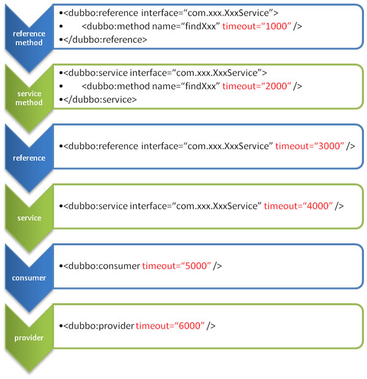
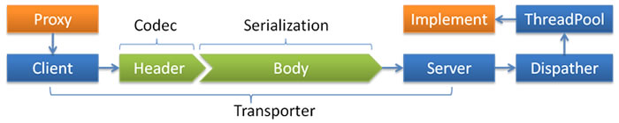

#dubbo

[http://dubbo.io/]

[TOC]

## service工程是api，provider和consumer共享

## provider工程是服务提供者，依赖service


## consumer工程是服务消费者，依赖service

## dubbo几个重要的标签

- <dubbo:service/> 
服务配置，用于暴露一个服务，定义服务的元信息，一个服务可以用多个协议暴露，一个服务也可以注册到多个注册中心。

- <dubbo:reference/> 
引用配置，用于创建一个远程服务代理，一个引用可以指向多个注册中心。

- <dubbo:protocol/> 协议配置，用于配置提供服务的协议信息，协议由提供方指定，消费方被动接受。

- <dubbo:application/> 
应用配置，用于配置当前应用信息，不管该应用是提供者还是消费者。

- <dubbo:module/> 
模块配置，用于配置当前模块信息，可选。

- <dubbo:registry/> 
注册中心配置，用于配置连接注册中心相关信息。

- <dubbo:monitor/> 
监控中心配置，用于配置连接监控中心相关信息，可选。

- <dubbo:provider/> 提供方的缺省值，当ProtocolConfig和ServiceConfig某属性没有配置时，采用此缺省值，可选。

- <dubbo:consumer/>
消费方缺省配置，当ReferenceConfig某属性没有配置时，采用此缺省值，可选。

- <dubbo:method/> 
方法配置，用于ServiceConfig和ReferenceConfig指定方法级的配置信息。

- <dubbo:argument/> 
用于指定方法参数配置。

## 参数加载优先级



总结：
上图中，蓝色的代表消费者的配置参数，青色的是提供者的配置参数，可以看出同一个位置的参数，消费的优先级比提供者的高。
- 方法级优先，接口级次之，全局配置再次之。
- 如果级别一样，则消费方优先，提供方次之。

duubo开发者给出的建议：
**其中，服务提供方配置，通过URL经由注册中心传递给消费方。**

**建议由服务提供方设置超时，因为一个方法需要执行多长时间，服务提供方更清楚，如果一个消费方同时引用多个服务，就不需要关心每个服务的超时设置。**

理论上ReferenceConfig的非服务标识配置，在ConsumerConfig，ServiceConfig, ProviderConfig均可以缺省配置。

## 负载均衡

dubbo 默认实现了以下几种负载均衡算法，默认采用随机算法：

- **Random LoadBalance**
随机，按权重设置随机概率。
在一个截面上碰撞的概率高，但调用量越大分布越均匀，而且按概率使用权重后也比较均匀，有利于动态调整提供者权重。

- **RoundRobin LoadBalance**
轮循，按公约后的权重设置轮循比率。
存在慢的提供者累积请求问题，比如：第二台机器很慢，但没挂，当请求调到第二台时就卡在那，久而久之，所有请求都卡在调到第二台上。


- **LeastActive LoadBalance**
最少活跃调用数，相同活跃数的随机，活跃数指调用前后计数差。
使慢的提供者收到更少请求，因为越慢的提供者的调用前后计数差会越大。


- **ConsistentHash LoadBalance**
一致性Hash，相同参数的请求总是发到同一提供者。
当某一台提供者挂时，原本发往该提供者的请求，基于虚拟节点，平摊到其它提供者，不会引起剧烈变动。算法参见：http://en.wikipedia.org/wiki/Consistent_hashing。
缺省只对第一个参数Hash，如果要修改，请配置
**<dubbo:parameter key="hash.arguments" value="0,1" />**
缺省用160份虚拟节点，如果要修改，请配置
**<dubbo:parameter key="hash.nodes" value="320" />**

负载均衡可以配置在服务提供者端，也可以配置在服务消费者端，细粒度在接口级别和方法级别。
官方给出如下配置：
```xml
// 服务提供者配置负载均衡，消费者被动接受，细粒度：接口级别
<dubbo:service interface="..." loadbalance="roundrobin" />
// 消费者主动配置负载均衡，细粒度：接口级别
<dubbo:reference interface="..." loadbalance="roundrobin" />
// 服务提供者配置负载均衡，消费者被动接受，细粒度：方法级别
<dubbo:service interface="...">
    <dubbo:method name="..." loadbalance="roundrobin"/>
</dubbo:service>
// 消费者主动配置负载均衡，细粒度：方法界别
<dubbo:reference interface="...">
    <dubbo:method name="..." loadbalance="roundrobin"/>
</dubbo:reference>
```

**那么问题来了，服务提供者和消费者的配置，谁的优先级别高？个人觉得和之前的参数优先级别一样，服务消费者高于服务提供者的配置；方法级别高于接口级别。**


## 线程模型

事件处理线程说明

- 如果事件处理的逻辑能迅速完成，并且不会发起新的IO请求，比如只是在内存中记个标识，则直接在IO线程上处理更快，因为减少了线程池调度。

- 但如果事件处理逻辑较慢，或者需要发起新的IO请求，比如需要查询数据库，则必须派发到线程池，否则IO线程阻塞，将导致不能接收其它请求。

- 如果用IO线程处理事件，又在事件处理过程中发起新的IO请求，比如在连接事件中发起登录请求，会报“可能引发死锁”异常，但不会真死锁。



**Dispatcher**

- all 
所有消息都派发到线程池，包括请求，响应，连接事件，断开事件，心跳等。

- direct 
所有消息都不派发到线程池，全部在IO线程上直接执行。

- message 
只有请求响应消息派发到线程池，其它连接断开事件，心跳等消息，直接在IO线程上执行。

- execution 只请求消息派发到线程池，不含响应，响应和其它连接断开事件，心跳等消息，直接在IO线程上执行。

- connection 
在IO线程上，将连接断开事件放入队列，有序逐个执行，其它消息派发到线程池。

**ThreadPool**

这个和java的ExecutorService执行框架很像。

- fixed 
固定大小线程池，启动时建立线程，不关闭，一直持有。(缺省)

- cached 
缓存线程池，空闲一分钟自动删除，需要时重建。

- limited 
可伸缩线程池，但池中的线程数只会增长不会收缩。(为避免收缩时突然来了大流量引起的性能问题)。

从上面可以看出，**这个配置是全局的，而且是配置在服务提供者这一端的**。

**dubbo 服务提供者的配置如下**
```xml
# dubbo 服务提供者配置

# 应用名称
dubbo.application.name=consumer-9587

# 注册中心地址和端口
dubbo.registry.address=zookeeper://10.240.178.73:2181

# dubbo 服务协议
dubbo.protocol.name=dubbo

# dubbo 服务端口
dubbo.protocol.port=20880

# 线程模型
## dispatcher: all/direct/message/execution/connection
dubbo.protocol.dispatcher=all
## threadpool: fixed/cached/limited
dubbo.protocol.threadpool=fixed
dubbo.protocol.threads=20
```
**在zk上查询provider节点的信息**
**[dubbo%3A%2F%2F10.242.92.158%3A20880%2Fcom.jql.yifan.service.HelloService%3Fanyhost%3Dtrue%26application%3Dconsumer-9587%26dispatcher%3Dall%26dubbo%3D2.5.3%26interface%3Dcom.jql.yifan.service.HelloService%26methods%3DsayHello%2Csum%26pid%3D9560%26revision%3D1.0.1%26sayHello.timeout%3D200%26side%3Dprovider%26sum.timeout%3D500%26threadpool%3Dfixed%26threads%3D20%26timestamp%3D1472089699699%26version%3D1.0.1]**

可以看到节点信息的一些关键字：dispatcher，all，threadpool，fixed，threads等。

## 直连提供者

这个功能为开发测试用的，绕过注册中心，只测试指定服务提供者。

这时候可能需要点对点直连，点对点直连方式，**将以服务接口为单位**，忽略注册中心的提供者列表，
A接口配置点对点，不影响B接口从注册中心获取列表。


需要直连提供者，只需要在消费者的配置文件中修改引用的服务：
```xml

<dubbo:reference id="xxxService" interface="com.alibaba.xxx.XxxService" url="dubbo://localhost:20888" />
```
或者加入运行参数：
```xml
java -Dcom.alibaba.xxx.XxxService=dubbo://localhost:20888
```

## 只订阅

直连服务提供者存在一个风险：为方便开发测试，经常会在线下共用一个所有服务可用的注册中心，这时，如果一个正在开发中的服务提供者注册，可能会影响消费者不能正常运行。

所以对直连服务提供者更好的改进是直连基础上，服务提供者不向注册中心发布正在开发的服务，而消费者直连正在开发的服务。

因此在服务提供者的配置文件中，禁止向注册中心注册：
```xml
<dubbo:registry address="${dubbo.registry.address}" register="false"/>
```
而服务消费的配置文件中，直连服务提供者：
```xml
    <dubbo:reference interface="com.jql.yifan.service.HelloService"
                     id="helloService"
                     version="1.0.1"
                     url="dubbo://localhost:20888"/>

    <dubbo:reference interface="com.jql.yifan.service.MessageService"
                     id="messageService"
                     version="1.0.1"
                     url="dubbo://localhost:20888"/>
```

## 只注册

此功能对于一个节点，即使服务提供者，又是服务消费者来说，比较有用。请看官网。

## 多协议暴露服务

下面配置中，发布了3个服务，1个用dubbo暴露，1个用hessian暴露，1个用dubbo/hessian都暴露。

```xml<?xml version="1.0" encoding="UTF-8"?>
<beans xmlns="http://www.springframework.org/schema/beans"
       xmlns:xsi="http://www.w3.org/2001/XMLSchema-instance"
       xmlns:dubbo="http://code.alibabatech.com/schema/dubbo"
       xmlns:context="http://www.springframework.org/schema/context"
       xsi:schemaLocation="http://www.springframework.org/schema/beans
       http://www.springframework.org/schema/beans/spring-beans.xsd
       http://code.alibabatech.com/schema/dubbo
       http://code.alibabatech.com/schema/dubbo/dubbo.xsd
       http://www.springframework.org/schema/context
       http://www.springframework.org/schema/context/spring-context.xsd">

    <context:property-placeholder location="classpath:/dubbo/dubbo.properties"/>

    <dubbo:application name="${dubbo.application.name}"/>

    <!--开发完成后,需要将register改成true,或者删除这个属性,否则注册中心没有该服务发布的节点信息-->
    <dubbo:registry address="${dubbo.registry.address}" register="false"/>

    // dubbo协议
    <dubbo:protocol name="dubbo"
                    port="${dubbo.protocol.port}"
                    dispatcher="${dubbo.protocol.dispatcher}"
                    threadpool="${dubbo.protocol.threadpool}"
                    threads="${dubbo.protocol.threads}"/>
    // hessian 协议
    <dubbo:protocol name="hessian"
                    port="${hessian.protocol.port}"
                    dispatcher="${hessian.protocol.dispatcher}"
                    threadpool="${hessian.protocol.threadpool}"
                    threads="${hessian.protocol.threads}"/>

    <!-- 使用多个协议暴露服务 -->
    <dubbo:service id="serviceAAA" interface="com.jql.service.ServiceAAA" version="1.0.0" protocol="dubbo,hessian" />

    <!-- 使用dubbo协议暴露服务 -->
    <dubbo:service interface="com.jql.service.ServiceBBB" version="1.0.0" ref="serviceBBB" protocol="dubbo" />
    <!-- 使用rmi协议暴露服务 -->
    <dubbo:service interface="com.jql.service.ServiceCCC" version="1.0.0" ref="serviceCCC" protocol="rmi" />

</beans>
```

## 服务分组

当一个接口有多种实现时，可以用group区分。

```xml
// 服务提供者
<dubbo:service group="feedback" interface="com.xxx.IndexService" />
<dubbo:service group="member" interface="com.xxx.IndexService" />
//服务消费者
<dubbo:reference id="feedbackIndexService" group="feedback" interface="com.xxx.IndexService" />
<dubbo:reference id="memberIndexService" group="member" interface="com.xxx.IndexService" />
// 消费者可以选择使用任意分组
<dubbo:reference id="barService" interface="com.foo.BarService" group="*" />
```

## 多版本

当一个接口实现，出现不兼容升级时，可以用版本号过渡，**版本号不同的服务相互间不引用**。

**升级策略：**
**1. 在低压力时间段，先升级一半提供者为新版本**
**2. 再将所有消费者升级为新版本**
**3. 然后将剩下的一半提供者升级为新版本**
这样子，当第2步出现问题时，可以下线升级的那一半服务提供者，而不影响业务；当第二步升级成功时，再升级第3步。

```xml
// 服务提供者
<dubbo:service interface="com.foo.BarService" version="1.0.0" />
<dubbo:service interface="com.foo.BarService" version="2.0.0" />
// 服务消费者
<dubbo:reference id="barService" interface="com.foo.BarService" version="1.0.0" />
<dubbo:reference id="barService" interface="com.foo.BarService" version="2.0.0" />
// 消费者可以选择忽略版本号调用
<dubbo:reference id="barService" interface="com.foo.BarService" version="*" />
```


